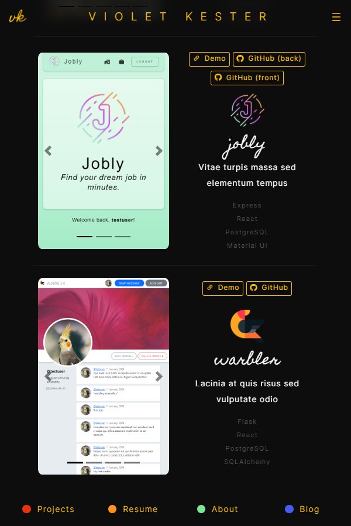
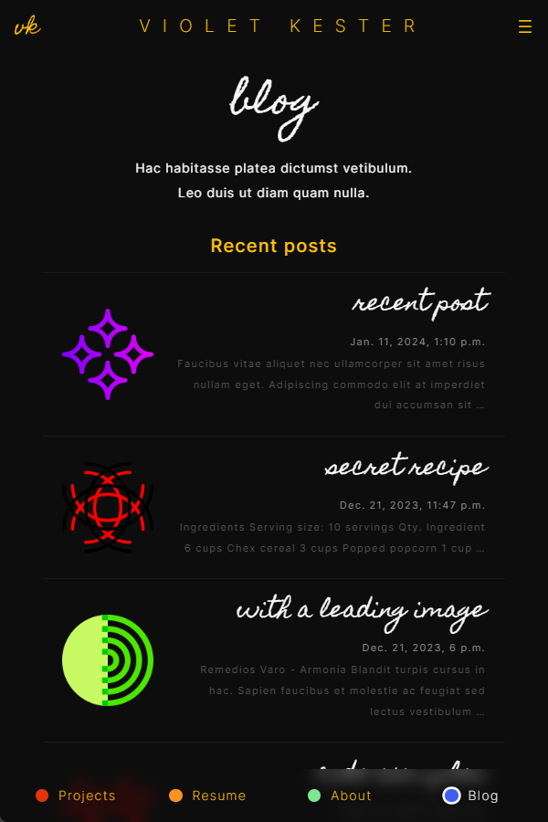
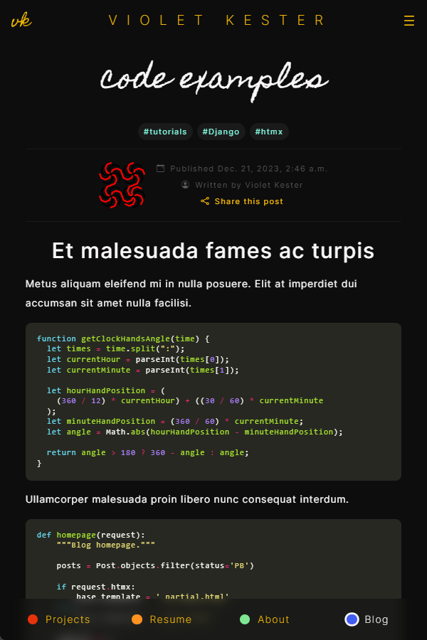
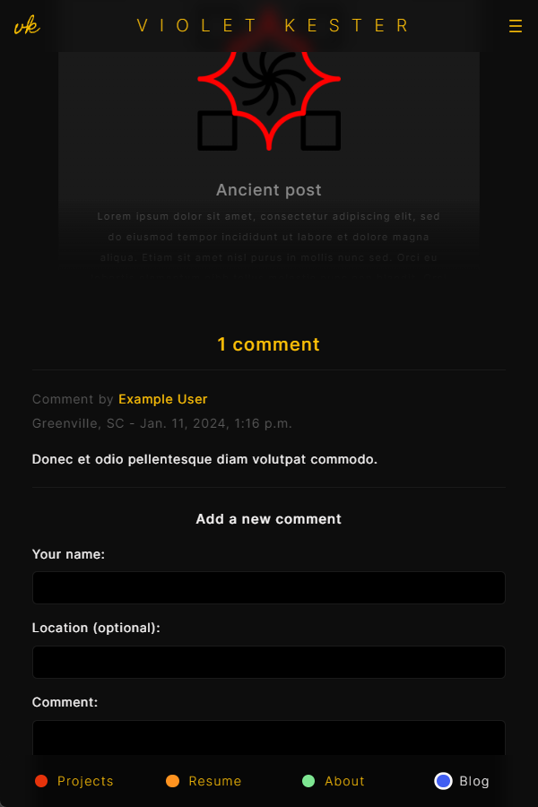
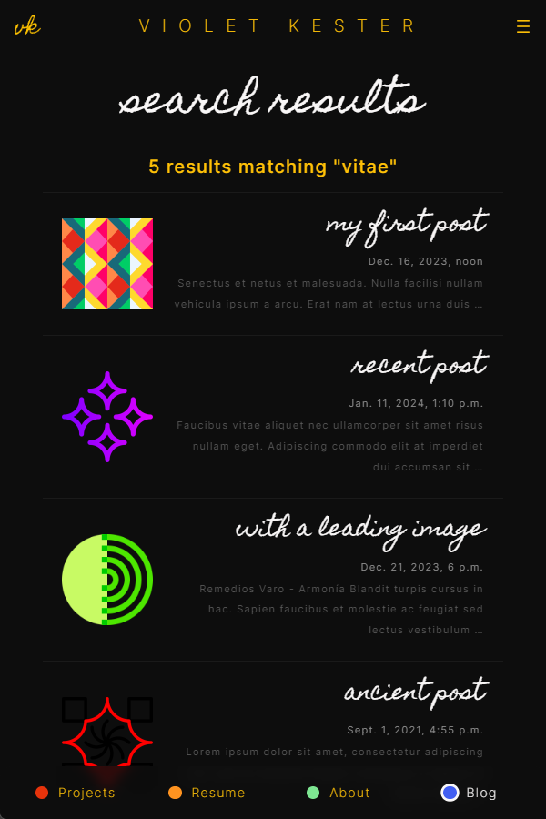

<!-- header -->

  
  <h1>Portfolio Website</h1>
  

    <i>My personal website and blog.</i>
  

  

    Django | PostgreSQL | htmx | hyperscript | Bootstrap
  

<!-- images  -->

  <h3>Image Gallery</h3>
  

  

    
    
    
    
    
    
  

<!-- installation -->

  <h3>Running the application</h3>
  

  

    In your project directory:
  

  <h4>1. Clone the repository.</h4>
  

    <code>git clone https://github.com/violet-kester/portfolio-website.git</code>
  

  <h4>2. Activate the virtual environment and install dependencies.</h4>
  

   <code>python3 -m venv venv</code> 
   <code>source venv/bin/activate</code> 
   <code>pip install -r requirements.txt</code>
  

  <h4>
    3. Create the database.
  </h4>
  

    <code>createdb vk_portfolio_website</code> 
  

  <h4>
    4. Configure environment variables.
  </h4>
  

    Create an <code>.env</code> file and add the following values to it:
  

  

    <code>SECRET_KEY=your-secret-key-here</code> 
    <code>DB_NAME=vk_portfolio_website</code> 
    <code>DB_USER=your-db-username-here</code> 
    <code>DB_PASS=your-db-password-here</code> 
    <code>DEBUG=True</code>
  

  <h4>
    3. Start the development server.
  </h4>
  

    <code>python manage.py runserver</code>
  

  <h4>
    4. Open the app in your browser at <a href='http://127.0.0.1:8000/'>http://127.0.0.1:8000/</a>.
  </h4>

