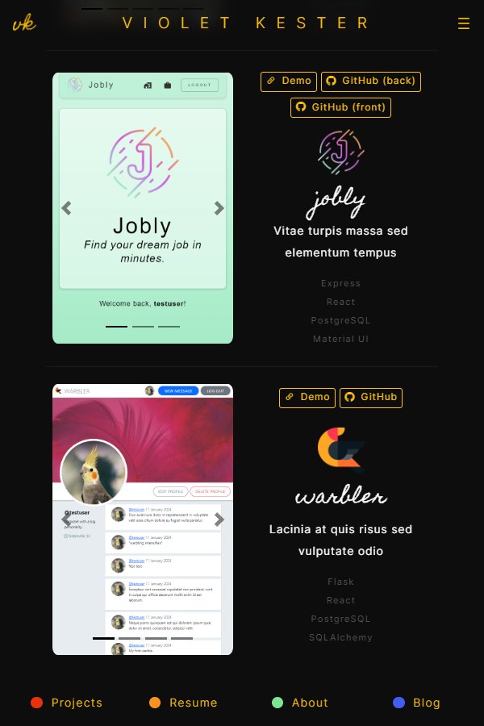
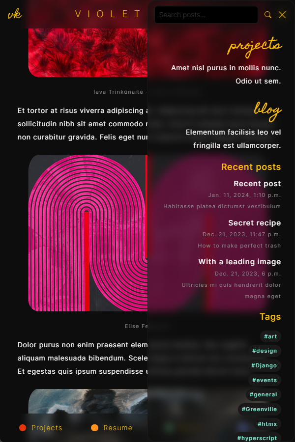
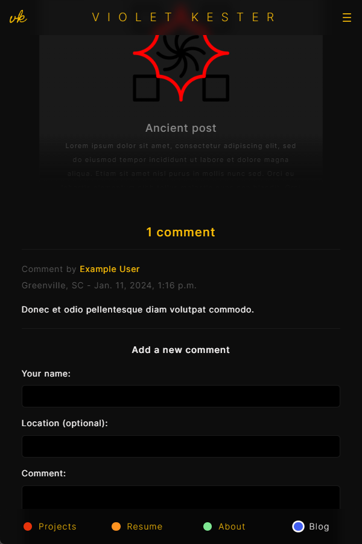
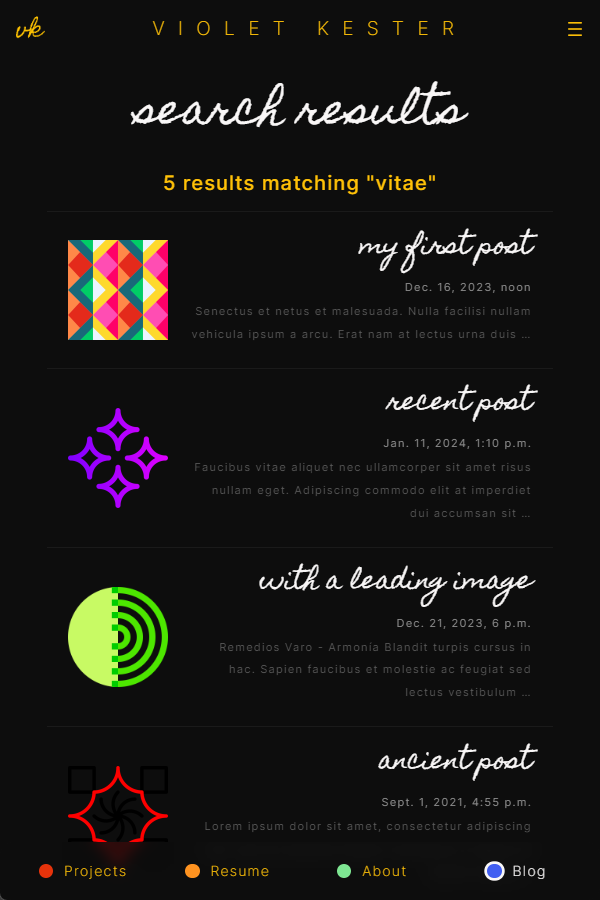

<!-- Header -->

<div align='center'>
  

  <h1>Portfolio Website</h1>

  <p>
    <i>My portfolio website and blog.</i>
  </p>
  <p>
    Django | PostgreSQL | WhiteNoise | S3 | CloudFront | htmx | hyperscript | Bootstrap
  </p>
  <p>
    <a href='https://violetkester.com' target='_blank'>
      Visit my website
    </a>
  </p>
</div>

<!-- Installation -->

<!-- <div>
  <h3>Running the application</h3>
  <hr/>
  <p>
    In your project directory:
  </p>
  <h4>1. Clone the repository.</h4>
  <p>
    <code>git clone https://github.com/violet-kester/portfolio-website.git</code>
  </p>
  <h4>2. Activate the virtual environment and install dependencies.</h4>
  <p>
   <code>python3 -m venv venv</code><br />
   <code>source venv/bin/activate</code><br />
   <code>pip install -r requirements.txt</code>
  </p>
  <h4>
    3. Create the database.
  </h4>
  <p>
    <code>createdb vk_portfolio_website</code><br/>
  </p>
  <h4>
    4. Configure environment variables.
  </h4>
  <p>
    Create an <code>.env</code> file and add the following values to it:
  </p>
  <p>
    <code>SECRET_KEY=your-secret-key-here</code><br/>
    <code>DB_NAME=vk_portfolio_website</code><br/>
    <code>DB_USER=your-db-username-here</code><br/>
    <code>DB_PASS=your-db-password-here</code><br/>
    <code>DEBUG=True</code>
  </p>
  <h4>
    3. Start the development server.
  </h4>
  <p>
    <code>python manage.py runserver</code>
  </p>
  <h4>
    4. Open the app in your browser at <a href='http://127.0.0.1:8000/'>http://127.0.0.1:8000/</a>.
  </h4>
</div> -->

<!-- Project structure -->

<h3>Project Structure</h3>
<hr/>

```
website/
│
│
├── blog/
│   ├── migrations/
│   ├── templatetags/
│   │   ├── __init__.py
│   │   └── blog_tags.py
│   ├── __init__.py
│   ├── admin.py
│   ├── apps.py
│   ├── forms.py
│   ├── models.py
│   ├── urls.py
│   └── views.py
│
│
├── core/
│   ├── templatetags/
│   │   ├── __init__.py
│   │   └── markdown.py
│   ├── __init__.py
│   ├── apps.py
│   ├── forms.py
│   ├── urls.py
│   └── views.py
│
│
├── projects/
│   ├── migrations/
│   ├── templatetags/
│   │   └── project_tags.py
│   ├── __init__.py
│   ├── admin.py
│   ├── apps.py
│   ├── models.py
│   ├── urls.py
│   └── views.py
│
│
├── static/
│   ├── css/
│   │   ├── bootstrap-theme.min.css
│   │   ├── styles.css
│   │   └── syntax-highlighting.css
│   └── img/
│       ├── icons/
│       ├── logos/
│       ├── photos/
│       ├── screenshots/
│       └── favicon.ico
│
│
├── staticfiles/
│
│
├── templates
│   ├── blog/
│   │   ├── post/
│   │   │   ├── forms/
│   │   │   │   ├── comment_form.html
│   │   │   │   ├── search_form.html
│   │   │   │   └── share_form.html
│   │   │   ├── comment.html
│   │   │   ├── detail.html
│   │   │   ├── latest_posts.html
│   │   │   ├── list.html
│   │   │   ├── search_results.html
│   │   │   ├── share.html
│   │   │   └── tag_results.html
│   │   └── index.html
│   ├── core/
│   │   ├── about.html
│   │   ├── index.html
│   │   ├── navbar_page_links.html
│   │   ├── navbar.html
│   │   ├── resume.html
│   │   └── sidebar.html
│   ├── projects/
│   │   ├── detail.html
│   │   ├── index.html
│   │   ├── latest_projects.html
│   │   ├── link_buttons.html
│   │   ├── list.html
│   │   ├── screenshot_carousel.html
│   │   └── technologies_list.html
│   ├── _base.html
│   └── _partial.html
│
│
├── venv/
│
│
├── website/
│   ├── __init__.py
│   ├── asgi.py
│   ├── settings.py
│   ├── urls.py
│   └── wsgi.py
│
│
├── .env
│
│
├── .gitignore
│
│
├── manage.py
│
│
├── README.md
│
│
└── requirements.txt
```

<!-- Images  -->

<h3>Image Gallery</h3>
<hr/>
<div class='images-container' align='center'>
  
  
  
  
  
  
</div>